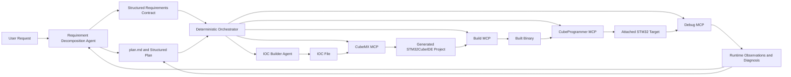

# STM32 Agent Block Architecture

## Purpose

This document captures the pre-implementation block architecture for the long-horizon STM32 agent workflow. It is derived from `design.md` and is intended to be reviewed before code addition begins.

## Architectural Principles

- keep prompt understanding separate from deterministic tool execution
- keep orchestration narrow and execution-focused
- keep each module testable with explicit inputs and outputs
- implement the core feature first, then add pluggable features one at a time
- maintain request progress in `plan.md` across long-running work

## Top-Level Blocks

## Module Responsibilities

### 1. Requirement Decomposition Agent

Responsibilities:

- interpret the user request
- detect ambiguity and request clarification when needed
- separate core features from pluggable features
- create a long-horizon execution plan
- update `plan.md` with status and next actions

Inputs:

- user prompt
- optional prior `plan.md`
- optional hardware/project context

Outputs:

- structured requirements contract
- ordered feature plan
- `plan.md` updates

### 2. Deterministic Orchestrator

Responsibilities:

- execute already-decided steps only
- pass explicit tool payloads to domain MCP servers
- record success, failure, and artifacts
- keep execution slices narrow and reproducible

Inputs:

- structured requirements contract
- current plan state
- project metadata

Outputs:

- tool invocations
- execution results
- status updates for `plan.md`

### 3. IOC Builder Agent

Responsibilities:

- construct or mutate IOC deterministically
- use a hybrid seed-plus-mutate builder rather than freeform IOC emission
- apply board-aware defaults and constraints
- preserve board-reserved settings while applying only required deltas
- emit a valid IOC for downstream regeneration

Inputs:

- structured requirements contract
- board profile or seed IOC
- MCU and IP metadata

Outputs:

- generated or updated IOC file
- IOC change summary

#### Why This Module Is Critical

The IOC Builder Agent is the highest-risk design area because it sits between prompt-derived requirements and the strict, partially implicit `.ioc` conventions expected by CubeMX. For this reason, the architecture should explicitly reject freeform raw IOC generation and instead use a deterministic compiler-style workflow.

#### Recommended Builder Strategy

The recommended design is a hybrid deterministic builder:

1. select an official ST board IOC when a board seed exists
2. convert requirements into a canonical internal model
3. resolve legal capabilities from ST MCU and IP metadata
4. apply deterministic pin and peripheral mutations onto the seed
5. validate the resulting IOC structurally and through CubeMX acceptance

This is preferred over a pure emitter because `.ioc` files contain many implicit conventions that are safer to preserve from ST-provided board seeds.

#### Internal Submodules

The IOC Builder Agent should be split into these narrow internal modules:

- `st_seed_catalog`: maps board name to official ST board IOC
- `st_mcu_catalog`: resolves MCU name to ST MCU XML and parsed capabilities
- `ioc_model`: canonical in-memory model derived from the structured requirements contract
- `ioc_construct`: creates the base IOC from an ST board seed
- `ioc_mutate`: applies deterministic deltas to the IOC
- `ioc_validate`: performs local structural validation plus CubeMX acceptance checks

This split keeps the builder modular and makes each stage independently testable.

#### Seed Selection Layer

The first builder stage should be seed selection.

Rules:

- prefer an official ST board IOC as the starting point
- for `NUCLEO-L476RG`, use the official ST board seed IOC as the canonical base
- if no board seed exists, fall back later to an MCU-family template path rather than inventing raw IOC text directly

This stage is responsible for selecting a trustworthy baseline before any requirement-specific mutation occurs.

#### Canonical Internal Model

The builder should convert the structured requirements contract into a strict internal model rather than mutating IOC text directly from prompt-derived data.

The canonical model should include at minimum:

- board
- mcu
- required peripherals
- required signals
- reserved board pins
- generated labels
- clock requirements
- interrupt requirements

This model keeps the LLM out of raw IOC text generation and creates a stable surface for deterministic logic and testing.

#### ST Metadata Resolver

The builder should parse `mcu/*.xml` and `mcu/IP/*.xml` into a local capability index.

The resolver should answer these questions:

- which peripherals exist on the target MCU
- which pins support which alternate functions
- which GPIO mode names are legal
- which IP-specific option names and values are legal

Important constraint:

- ST MCU XML filenames use grouped naming conventions, not a naive literal package-name mapping, so the builder must include a mapping step from CubeMX-style MCU names to the repository filename pattern

#### Deterministic Allocator And Mutator

The allocator and mutator should start from the board seed and preserve board-reserved defaults. It should then apply only the deltas required by the current feature slice.

For the current NUCLEO-L476RG scope, that means changes such as:

- enable `USART2`
- ensure `PA2 = USART2_TX`
- optionally ensure `PA3 = USART2_RX`
- preserve LED, button, clock, and debug pin reservations
- update `Mcu.IP*`, `Mcu.Pin*`, and related property blocks deterministically

This design is safer than a pure emitter because it changes only the minimum required state on top of a known-good ST board configuration.

#### Validation Loop

After the IOC is written, the builder should validate it before the main workflow proceeds.

Validation sequence:

1. run a structural validator in Python
2. run CubeMX headless to confirm the IOC is accepted
3. only after successful IOC acceptance, hand control to the existing `cubemx -> build -> flash` stages

CubeMX should be treated as the final IOC accept or reject oracle.

#### Phased Implementation Path

The builder should be introduced incrementally rather than replacing the existing patcher in one step.

Phase 1 should stay narrow:

- support only `NUCLEO-L476RG`
- support only the existing `device_to_pc_tx` flow
- add a new construction mode beside the current patcher instead of replacing it immediately

For this repo, the current implementation in `src/stm32cubep_mcp/ioc_builder/server.py` already has the correct board-aware deterministic shape. The first architectural extension should therefore be a pre-step that materializes a base IOC from ST data before the existing deterministic update logic runs.

#### Control Boundary For This Module

The IOC Builder Agent must not:

- interpret freeform user intent directly
- become a general planner
- emit raw IOC text from unconstrained LLM output

The IOC Builder Agent must:

- accept a structured contract from the planning layer
- operate deterministically and board-aware
- expose clear intermediate representations for testing and diagnosis

### 4. Tool-Domain MCP Servers

CubeMX MCP:

- generate project from IOC
- detect completion and report generation results

Build MCP:

- build the generated project
- report compiler and linker errors

CubeProgrammer MCP:

- flash image to target
- report connection and programming failures

Debug MCP:

- launch debug session
- inspect runtime state
- support diagnosis on the attached target

## Control Boundaries

The architecture must preserve these boundaries:

- Requirement Decomposition Agent decides what to do next.
- Orchestrator decides only how to execute the already-decided step sequence.
- Tool-domain MCP servers should remain deterministic and domain-local.
- IOC Builder should not become a freeform prompt interpreter.

## Long-Horizon Execution Model

The expected long-horizon execution loop is:

1. define the minimum working core feature
2. generate and validate the project for that core feature
3. build and flash to hardware
4. inspect runtime behavior through debug and diagnostics
5. update `plan.md`
6. move to the next pluggable feature only after the current slice is stable
