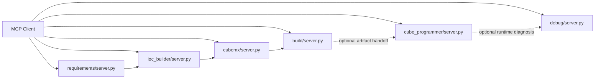
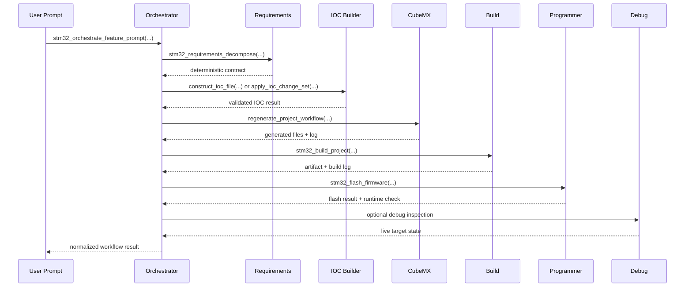

# End-To-End Call Chain

This note ties together the top-of-file call-chain documentation that now lives
inside the main MCP entry modules.

## Which Diagram To Read First

Read `Direct Server Diagram` first when you already know which MCP domain you
want to call and only need the server-to-server handoff shape. Read
`Sequence Diagram` first when you want the full orchestrated feature-delivery
path from user prompt through requirements, IOC mutation, generation, build,
flash, and optional runtime inspection.

## Feature Delivery Path

The main repository flow for a natural-language feature request is:

1. `stm32_orchestrate_feature_prompt(...)` in the orchestrator server receives the user prompt.
2. `application.workflows.generate_project.orchestrate_feature_delivery(...)` runs the end-to-end delivery workflow.
3. `requirements.server.stm32_requirements_decompose(...)` turns the prompt into a deterministic requirements contract.
4. `application.services.ioc_builder_service.construct_ioc_file(...)` or `apply_ioc_change_set(...)` converts that contract into IOC mutations and validates them with CubeMX.
5. `application.workflows.cubemx_regeneration.regenerate_project_workflow(...)` runs CubeMX generation, waits for completion, diffs generated files, and records a log.
6. `build.server.stm32_build_project(...)` imports and builds the generated project through STM32CubeIDE headless build.
7. `cube_programmer.server.stm32_flash_firmware(...)` flashes the selected artifact to the target and optionally performs a post-flash runtime check.
8. The runtime-validation stage can then use the debug server when live inspection is needed.

## Direct Server Paths

The repository also supports direct MCP usage without going through the main orchestrator.

- `requirements/server.py` owns prompt-to-contract translation.
- `cubemx/server.py` and `application/workflows/cubemx_regeneration.py` own code regeneration from IOC to generated sources.
- `build/server.py` owns headless project import/build.
- `cube_programmer/server.py` owns CLI transport for connect, flash, memory, and core-control actions.
- `debug/server.py` owns managed debug sessions, ARM GDB batch execution, SVD-backed peripheral inspection, and runtime snapshots.

## Direct Server Diagram

## Ownership Boundaries

- Orchestrator modules decide which domain workflow to run.
- Application workflows compose domain stages into a larger delivery sequence.
- Requirements modules interpret prompts into deterministic contracts.
- IOC builder and CubeMX modules transform contracts into generated project files.
- Build modules compile the generated or existing project.
- Programmer modules talk to STM32CubeProgrammer CLI.
- Debug modules talk to ST-LINK GDB Server and ARM GDB for live inspection.

That separation is why the repo can support both full prompt-driven automation and narrower single-domain MCP calls without mixing responsibilities inside one server.

## Sequence Diagram

