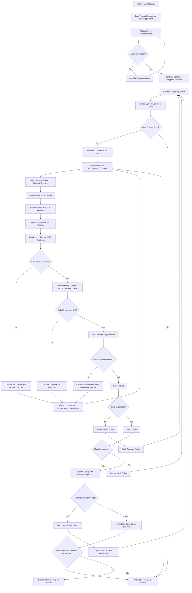

# STM32 Agent Workflow Flowchart

## Purpose

This document captures the execution flow for the future long-horizon STM32 workflow before implementation begins.

## End-To-End Flow

## Flow Rules

1. never jump directly from prompt to full implementation in one step
2. always create or update `plan.md` before major execution begins
3. always implement core capability before optional pluggable features
4. only add one pluggable feature per loop
5. each loop must include seed selection, IOC modeling, deterministic mutation, IOC validation, generation, build, flash, and runtime validation when applicable
6. failures must feed back into the plan instead of being treated as terminal by default

## Decision Points

The key decision points are:

- whether the request is ambiguous
- whether the current slice is still core scope or has moved into pluggable scope
- whether IOC structural checks, CubeMX IOC acceptance, generation, build, flash, and runtime checks succeeded
- whether the next action is repair, clarification, or feature advancement

## IOC Builder Subflow

The IOC Builder portion of the flow is intentionally decomposed into these stages:

1. select a trusted ST board seed IOC when available
2. convert the requirements contract into a canonical IOC model
3. resolve legal MCU and IP capabilities from ST metadata
4. apply deterministic seed-preserving mutations
5. validate locally before using CubeMX as the final IOC accept or reject oracle

This keeps the critical IOC path deterministic and reviewable before downstream generation begins.
