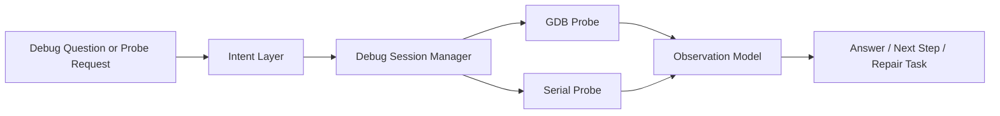

# STM32 Agent Modular Architecture

## Purpose

This document defines the target architecture for `stm32cubep-mcp` as a modular STM32 engineering agent platform.

The architecture is intentionally broader than "descriptive requirement to generated binary" because this repo is expected to support three major agent workloads:

1. create or extend STM32 projects from descriptive requirements
2. fix bugs in existing firmware, rebuild, flash, and if possible validate on hardware
3. support live debugging and hardware inspection during development and repair loops

The goal is to evolve the current codebase into a system where LLM-driven reasoning is allowed, but deterministic execution, validation, and safety remain explicit and testable.

## Design Goals

- keep the code structure modular enough that project generation, bug fixing, build, flash, and live debug can evolve independently
- avoid one-off prompt-family code as the primary scaling mechanism
- use official ST metadata and local tool databases as the main source of hardware truth
- keep orchestration narrow and stateful rather than clever and implicit
- allow subagents to participate in planning and repair without coupling them to tool execution internals
- persist plans, failures, artifacts, and observations so long-running work can resume safely

## Non-Goals

- do not make the orchestrator itself an open-ended autonomous planner
- do not let the LLM write raw `.ioc` files directly
- do not encode every STM32 feature family as a bespoke end-to-end compiler path
- do not depend on GitHub availability for core project generation when local CubeMX data is available

## Context From The Current Repo

Today the repo already has useful domain packages:

- `requirements`: prompt routing, contract creation, plan persistence
- `ioc_builder`: IOC acquisition, mutation, validation
- `cubemx`: script generation and project regeneration
- `build`: CubeIDE headless build execution
- `cube_programmer`: flash/connect/reset operations
- `debug`: GDB server lifecycle and runtime inspection
- `orchestrator`: top-level workflow routing and incremental delivery loop

This is a good starting point, but the current design still mixes three concerns too tightly:

- natural-language understanding
- feature-to-IOC synthesis
- workflow execution and repair

Those concerns should be separated more sharply.

## Core Architectural Principles

### 1. Thin Transport, Rich Application Layer

MCP server entrypoints should stay thin. They should translate tool calls into internal application services, not own business logic.

### 2. LLM For Intent, Deterministic Code For Execution

The LLM should be used to:

- interpret descriptive requirements
- summarize bug reports and logs
- propose likely fixes
- classify confidence and ambiguity
- choose among candidate baselines or prior successful cases

Deterministic code should be used to:

- read project state
- apply IOC edits
- generate CubeMX scripts
- run CubeMX, CubeIDE, CubeProgrammer, and debug tools
- validate artifacts and runtime results
- decide whether a workflow step passed or failed

### 3. Generic Operation IR Instead Of Per-Peripheral Endpoints

The generic scaling unit should not be "new handwritten parser for each peripheral request."

It should be a small set of reusable operations over STM32 project state, such as:

- `select_baseline`
- `enable_ip`
- `assign_signal`
- `set_pin_mode`
- `set_ip_param`
- `set_clock_param`
- `bind_dma`
- `enable_interrupt`
- `set_project_option`
- `patch_firmware`
- `run_codegen`
- `run_build`
- `run_flash`
- `run_runtime_probe`

This keeps the system generic while still deterministic.

### 4. Official Baselines First

For new projects, the first baseline should come from official local CubeMX board data when available.

On this machine, CubeMX already ships official board starter IOCs, including:

- [B40_Nucleo_NUCLEO-L476RG_STM32L476RG_Board.ioc](</C:/Program Files/STMicroelectronics/STM32Cube/STM32CubeMX/db/plugins/boardmanager/boards/B40_Nucleo_NUCLEO-L476RG_STM32L476RG_Board.ioc>)
- [B40_Nucleo_NUCLEO-L476RG_STM32L476RG_Board_AllConfig.ioc](</C:/Program Files/STMicroelectronics/STM32Cube/STM32CubeMX/db/plugins/boardmanager/boards/B40_Nucleo_NUCLEO-L476RG_STM32L476RG_Board_AllConfig.ioc>)

These should be preferred over downloading a remote `.ioc` from GitHub.

### 5. Everything Important Must Be Persisted

Plans, artifacts, failures, and observations must be recorded so the agent can:

- resume partially completed work
- avoid repeating failed actions blindly
- hand work across subagents
- ask the user to review concrete evidence when the loop gets stuck

## Recommended Top-Level Module Layout

The target package layout under `src/stm32cubep_mcp/` should move toward the following shape:

```text
stm32cubep_mcp/
  transport/
    mcp/
      orchestrator_server.py
      build_server.py
      cubemx_server.py
      programmer_server.py
      debug_server.py

  application/
    workflows/
      generate_project.py
      extend_project.py
      fix_bug.py
      build_flash_test.py
      live_debug.py
    services/
      plan_service.py
      artifact_service.py
      workspace_service.py
      result_service.py
      failure_service.py

  intent/
    contracts.py
    planners.py
    classifiers.py
    prompt_analysis.py
    llm_bridge.py

  project_model/
    project_state.py
    workspace_snapshot.py
    plan_state.py
    change_set.py
    observations.py

  ioc/
    baseline_selector.py
    db_index.py
    operation_ir.py
    compiler.py
    mutator.py
    validator.py
    script_builder.py
    board_catalog.py
    mcu_catalog.py

  firmware/
    patch_planner.py
    patch_executor.py
    diagnostics.py

  tools/
    cubemx_adapter.py
    cubeide_adapter.py
    programmer_adapter.py
    stlink_gdb_adapter.py

  runtime/
    probe_catalog.py
    register_decoder.py
    serial_probe.py
    gdb_probe.py

  knowledge/
    cubemx_db/
      indexer.py
      query.py
    corpora/
      example_index.py
      case_store.py
      retrieval.py

  shared/
    config.py
    paths.py
    logging.py
    jsonc.py
```

The current package names do not have to be replaced all at once, but the responsibilities should move in this direction.

## Package Responsibilities

### `transport`

Responsibilities:

- expose MCP tools
- validate input shape
- call application workflows
- normalize output for clients

Must not:

- parse STM32 engineering intent deeply
- own workflow state transitions
- mutate IOC files directly

### `application`

Responsibilities:

- coordinate use cases
- move state through explicit workflow stages
- enforce the incremental engineering loop
- publish artifacts, logs, and status updates

This is the layer that should implement the process model already agreed in this repo:

1. core features first
2. build after each increment
3. fix build issues before proceeding
4. flash after build
5. validate runtime behavior
6. fix runtime issues before next increment

### `intent`

Responsibilities:

- convert prompts, bug reports, and task requests into structured intent
- classify requests into generation, extension, bug-fix, build-only, flash-only, or live-debug flows
- split high-level requests into core features and pluggable features when needed
- call backend LLMs through a narrow interface

This layer should not know anything about CubeMX file syntax.

### `project_model`

Responsibilities:

- define typed internal state objects
- represent project state independent of any one tool
- provide canonical diff and observation structures

This becomes the shared language between planning, IOC work, firmware patching, build, flash, and runtime validation.

### `ioc`

Responsibilities:

- select official baseline IOC files
- index and query CubeMX databases
- convert intent into generic IOC operations
- apply operations safely to a managed IOC copy
- validate the result before code generation
- build the correct `script.txt` for CubeMX headless generation

This package is the most important generic backend for descriptive project generation.

### `firmware`

Responsibilities:

- patch user-code sections in generated firmware
- inject or modify small focused code fragments safely
- support source-code bug-fix workflows after generation
- capture compiler diagnostics and map them back to repair tasks

This package matters because many valid CubeMX projects still need user-code logic to become working binaries.

### `tools`

Responsibilities:

- wrap external executables with deterministic request and response objects
- hide process spawning, log files, timeouts, and exit-code handling
- make tools testable through adapter seams

### `runtime`

Responsibilities:

- inspect the target after flash
- decode live state using GDB, SVD, serial, or future probes
- provide observations back to repair workflows

This package supports both automated runtime validation and interactive live debugging.

### `knowledge`

Responsibilities:

- index local CubeMX DB files
- index successful generated cases in a separate corpus repo
- support retrieval of relevant baselines, prior solutions, and known-safe configuration patterns

This is the key to scaling beyond a handful of hand-coded feature families.

## Shared Internal Contracts

The repo needs a small number of stable internal contracts that all modules can share.

### 1. `AgentTask`

Represents what the agent is trying to do.

Suggested fields:

- `task_id`
- `task_kind`
- `source_prompt`
- `target_board`
- `target_mcu`
- `existing_project_path`
- `requested_outputs`
- `constraints`

### 2. `IntentBundle`

Represents structured intent from the LLM or deterministic classifier.

Suggested fields:

- `intent_kind`
- `confidence`
- `project_context`
- `core_requirements`
- `optional_requirements`
- `code_change_goals`
- `runtime_expectations`
- `open_questions`
- `assumptions`

### 3. `PlanState`

Represents the long-running engineering loop.

Suggested fields:

- `plan_id`
- `active_workflow`
- `increments`
- `current_increment`
- `attempt_history`
- `stuck_counter`
- `artifacts`
- `user_review_required`

### 4. `ProjectState`

Represents the current project as known by the system.

Suggested fields:

- `project_root`
- `managed_copy_root`
- `ioc_path`
- `script_path`
- `cubeide_project_path`
- `build_artifact_path`
- `source_inventory`
- `git_status`
- `board_context`
- `clock_context`

### 5. `IocOperation`

This is the most important new contract.

Suggested operation kinds:

- `set_property`
- `append_property_value`
- `remove_property_value`
- `assign_pin_signal`
- `set_pin_metadata`
- `enable_ip_instance`
- `set_ip_mode`
- `set_ip_parameter`
- `set_clock_value`
- `set_dma_route`
- `set_project_manager_value`

Each operation should contain:

- `op_id`
- `kind`
- `target`
- `value`
- `reason`
- `source_requirement_ids`

### 6. `Observation`

Represents evidence collected from build, flash, or live runtime.

Suggested fields:

- `stage`
- `source`
- `severity`
- `summary`
- `raw_log_path`
- `machine_readable_facts`
- `repair_hints`

## Workflow Architecture

### Workflow A: Descriptive Requirement To Tested Binary


Key rule:

- this workflow must operate on a managed project copy, not mutate the user's original project in place

### Workflow B: Existing Bug Fix Loop


Key rule:

- this flow should not depend on IOC generation unless the bug requires project configuration changes

### Workflow C: Live Debug Session



Key rule:

- live debug should be able to operate independently of the project-generation workflow

## How The Generic IOC Path Should Work

The IOC path should not be "LLM writes a full IOC."

It should be:

1. choose an official baseline
2. read local CubeMX DB metadata
3. compile structured intent into generic `IocOperation`s
4. apply operations to a managed IOC copy
5. validate with CubeMX
6. only proceed when generation is structurally valid

### Baseline Selection Order

Recommended order:

1. local official board IOC from CubeMX `db/plugins/boardmanager/boards`
2. local MCU-level baseline when board baseline does not exist
3. validated prior case from the corpus repo
4. remote official ST source as a fallback only

This is safer than making GitHub the primary baseline source.

### Why `STM32_open_pin_data` Is Still Useful

The public repo [STM32_open_pin_data](https://github.com/STMicroelectronics/STM32_open_pin_data) remains useful for:

- board and MCU discovery
- public pin capability inspection
- reproducible metadata outside the local machine

But it should not be the only backend because the local CubeMX installation contains much richer configuration metadata.

## The Role Of The Local CubeMX Database

The local CubeMX installation should become a first-class knowledge source.

Important local sources on this machine include:

- [db/mcu](</C:/Program Files/STMicroelectronics/STM32Cube/STM32CubeMX/db/mcu>)
- [db/mcu/config](</C:/Program Files/STMicroelectronics/STM32Cube/STM32CubeMX/db/mcu/config>)
- [db/mcu/config/llConfig](</C:/Program Files/STMicroelectronics/STM32Cube/STM32CubeMX/db/mcu/config/llConfig>)
- [db/plugins/boardmanager/boards](</C:/Program Files/STMicroelectronics/STM32Cube/STM32CubeMX/db/plugins/boardmanager/boards>)

Recommended approach:

- build an indexer that converts selected CubeMX DB files into normalized cached JSON
- query that JSON from the `ioc` compiler layer
- never hard-code data that already exists in CubeMX DB unless it is a guardrail or policy rule

## Corpus Repo Recommendation

A separate corpus repo is strongly recommended.

This repo should store validated engineering cases, not just random IOC files.

Recommended case layout:

```text
cases/
  <case-id>/
    prompt.md
    intent.json
    baseline.ioc
    operations.json
    final.ioc
    script.txt
    cubemx.log
    build.log
    flash.log
    runtime.json
    result.json
```

Suggested uses:

- retrieval of similar prior cases
- regression testing across many project intents
- prompt matrix evaluation
- tracking of fragile configuration patterns

This corpus repo should be treated as a knowledge asset and test asset, not as a deployment artifact.

## Subagent Model

The user clarified that this STM32 agent is part of a larger system where subagents may be assigned tasks like bug fixing, rebuilding, and live testing.

The architecture should therefore support specialized subagents through stable service boundaries.

Recommended subagent roles:

- `intent-planner`: converts prompt or bug report into structured intent
- `ioc-planner`: proposes IOC operations from structured intent
- `code-repair`: proposes source-level fixes from diagnostics
- `runtime-investigator`: interprets live observations from debug or serial probes
- `workflow-controller`: deterministic main orchestrator that decides what to execute next

Important rule:

- subagents may propose changes, but only deterministic services should execute tool actions and commit state transitions

## Mapping From Current Packages To Target Packages

### Current `requirements`

Target direction:

- split into `intent` and `application/services/plan_service`

Keep:

- plan persistence
- prompt classification helpers

Move out:

- feature-specific decomposition logic that should become LLM-backed intent planning

### Current `ioc_builder`

Target direction:

- split into `ioc/baseline_selector`, `ioc/compiler`, `ioc/mutator`, `ioc/validator`, `ioc/script_builder`, and `knowledge/cubemx_db`

Keep:

- managed-copy behavior
- mutation and validation logic

Replace over time:

- GitHub-first baseline logic
- feature-family-specific IOC synthesis rules

### Current `cubemx`

Target direction:

- keep as `tools/cubemx_adapter` plus a thin MCP transport wrapper

### Current `build`

Target direction:

- keep as `tools/cubeide_adapter` plus workflow wrappers

### Current `cube_programmer`

Target direction:

- keep as `tools/programmer_adapter` plus runtime workflows

### Current `debug`

Target direction:

- split into `tools/stlink_gdb_adapter` and `runtime/*`

### Current `orchestrator`

Target direction:

- reduce to `transport/mcp/orchestrator_server.py` plus `application/workflows/*`

This is the most important structural refactor. The orchestrator should become thinner as the application layer becomes richer.

## Suggested Migration Phases

### Phase 1: Internal Contracts And Package Split

- introduce shared internal contracts for intent, plan, project state, IOC operations, and observations
- create new target package directories while preserving current MCP tool behavior
- move orchestration logic into application workflows without changing external tool names yet

### Phase 2: Local CubeMX DB Index

- implement a DB indexer for board IOCs, MCU metadata, pin maps, IP configs, and DMA mappings
- make local board IOCs the default baseline source
- keep remote GitHub lookups as fallback only

### Phase 3: Generic IOC Operation Compiler

- replace feature-specific IOC synthesis with a compiler from structured intent to generic operations
- keep mutation whitelists and dangerous-key guards in the mutator

### Phase 4: Corpus Repo And Retrieval

- add case export from successful workflows
- add retrieval of similar prior cases during planning
- add matrix-driven regression runs

### Phase 5: Bug-Fix And Repair Workflows

- formalize source patch planning and application
- integrate compiler diagnostics and runtime observations into repair loops

### Phase 6: Live Debug Platform

- separate runtime probes from debug transport
- support reusable live-debug workflows independent of project generation

## Recommended Immediate Decisions

The following decisions should be adopted now:

1. use local official CubeMX board IOCs as the primary baseline for new projects
2. keep working on managed copies instead of mutating original projects in place
3. treat the local CubeMX DB as a first-class backend knowledge source
4. introduce a generic IOC operation IR before adding many more feature families
5. keep the MCP transport thin and move business logic downward into workflow and service layers
6. build a separate validated corpus repo once the operation IR exists

## Open Risks

- CubeMX DB formats are internal ST data structures and may vary across CubeMX versions
- some runtime validation still requires custom board-specific probes
- firmware repair loops can become noisy if patch application is not constrained tightly
- the LLM intent layer needs confidence and ambiguity handling so low-confidence parses do not trigger unsafe actions

## Definition Of Success

This architecture is successful when the repo can support all of the following through the same modular backbone:

- generate a new STM32 project from descriptive requirements
- extend an existing project using managed copies
- diagnose and repair build failures
- flash and validate on real hardware
- answer live debug questions from the running device

And when adding new capability usually means one of these, not a full new end-to-end path:

- extending the intent schema
- extending the IOC operation compiler
- adding a new runtime probe
- adding a new repair strategy
- adding a validated case to the corpus repo
